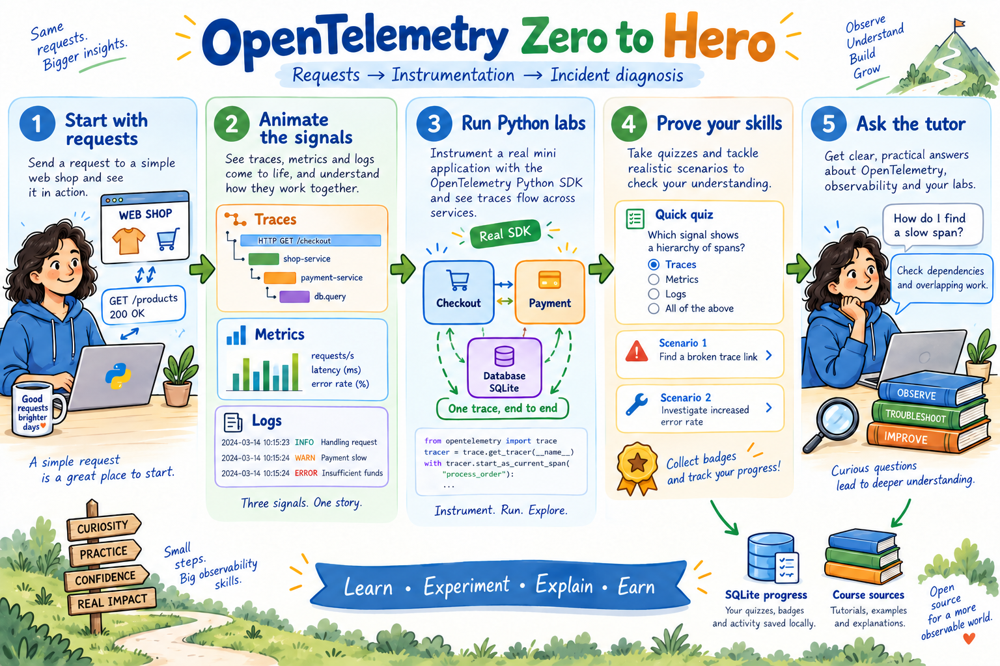
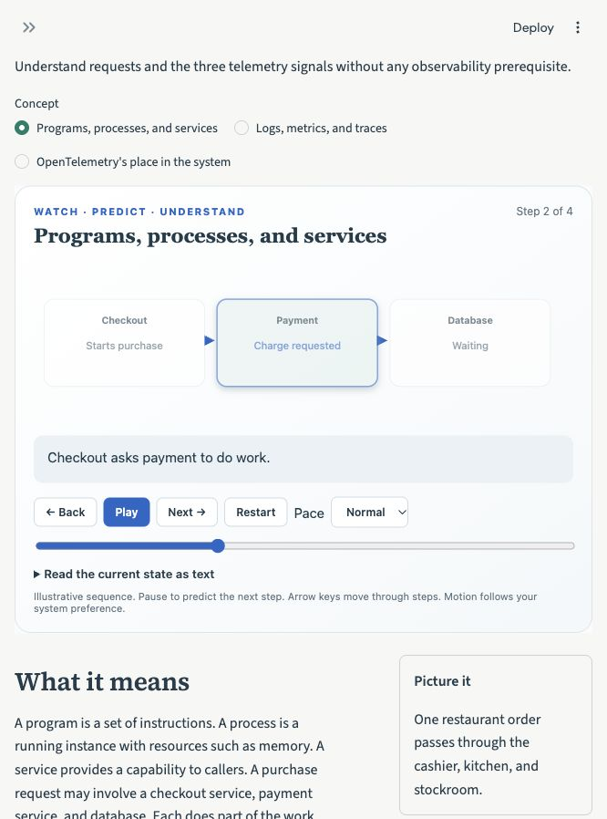
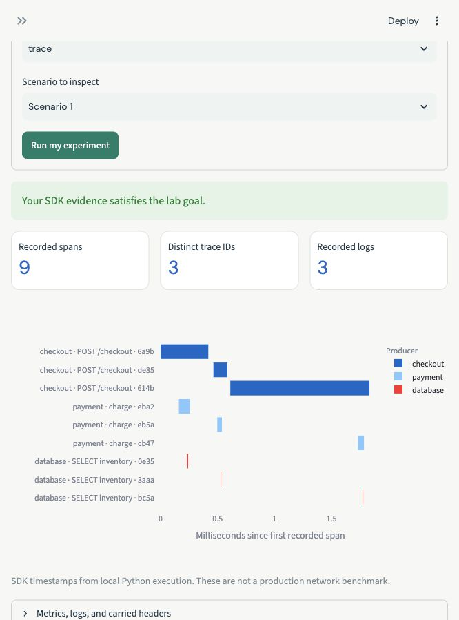
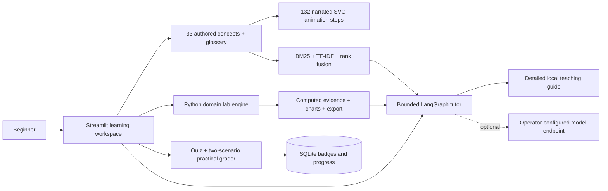

# OpenTelemetry Zero to Hero

[](https://github.com/sivalinb/opentelemetry-zero-to-hero/actions/workflows/ci.yml)


Start with a user request and learn logs, metrics, traces, spans, context, Python instrumentation, counters, gauges, histogram buckets, Collector pipelines, sampling, cardinality, redaction, and incident reasoning.

**No prerequisite infrastructure expertise, API key, or GPU purchase is needed to start.** This Python + Streamlit course has 11 levels (0–10), 33 guided concepts, 132 narrated animation steps, 33 practice checks, 55 quiz questions, 11 practical labs, and 11 badges.



*Illustrated teaching overview. The implemented lab boundaries and exact runtime behavior are described below; the drawing is not a screenshot or a hardware capability guarantee.*

## Start in one command

Install Python 3.11, 3.12, or 3.13, then:

```bash
git clone https://github.com/sivalinb/opentelemetry-zero-to-hero.git
cd opentelemetry-zero-to-hero
python3 scripts/bootstrap.py
```

On Windows, use `python` where your installation provides it. The bootstrap creates `.venv`, installs pinned dependencies, and opens a loopback Streamlit server. Visit **[http://127.0.0.1:8522](http://127.0.0.1:8522)**. Stop it with Ctrl+C. First installation needs Internet access to download packages; ordinary lessons and default experiments then run locally.

For an existing environment:

```bash
python -m pip install -r requirements.txt
python -m streamlit run app.py --server.address=127.0.0.1 --server.port=8522
```

## How learning works

1. **Learn:** choose a concept; predict the next frame, then use Play, Pause, Back, Next, speed, or the step slider. Every frame changes the illustrated state and explains what changed. An accessible text view describes the same state.
2. **Understand:** read the plain-language explanation, analogy, worked example, misconception, and glossary. Practice questions explain both correct and incorrect answers.
3. **Experiment:** run a plan, inspect actual computed evidence, and change the scenario. Hints are available without awarding a badge.
4. **Prove it:** score at least 80% on five questions **and** pass your practical plan on both scenario variants. Grading runs in Python; quiz answers or a client-supplied success flag cannot replace the practical check.
5. **Keep progressing:** each completed level earns 100 XP and a badge, then unlocks the next assessment. All lessons remain available to preview. Download your private resume code to reconnect to your locally stored SQLite profile.
6. **Ask:** the tutor retrieves detailed course material with sources. Select a topic before asking “explain this.” Optional model configuration enables conversational generation.




## Level 0 → Level 10

| Level | Topic | What you will learn to do | Badge |
|---|---|---|---|
| 00 | What happens when you click Buy? | Understand requests and the three telemetry signals without any observability prerequisite. | Signal Explorer |
| 01 | A request becomes a trace | Read spans, parent-child relationships, timing, and request identity. | Trace Reader |
| 02 | Context crosses a boundary | Understand how a caller carries trace context into a callee. | Context Carrier |
| 03 | Instrument Python with meaningful identity | Connect the API, SDK, resource identity, and operation attributes. | Python Instrumenter |
| 04 | Counters, gauges, and histograms | Choose a metric instrument and interpret its observations and units. | Metric Builder |
| 05 | Logs and errors belong to a journey | Connect logs, span status, exception events, and dependency evidence. | Correlated Investigator |
| 06 | Build a Collector pipeline | Separate reception, processing, export, and backend storage. | Pipeline Builder |
| 07 | Sampling without losing the story | Distinguish probability, parent decisions, tail decisions, and missing evidence. | Sampling Analyst |
| 08 | Privacy and cardinality | Preserve useful evidence while controlling unnecessary data and series growth. | Responsible Observer |
| 09 | Find inefficient work | Use operation evidence to identify repeated dependency work and verify a targeted change. | Workload Investigator |
| 10 | Recover a checkout incident | Connect signals, choose a targeted simulated response, and verify the resulting SDK evidence. | Telemetry Incident Solver |

## What actually executes

The UI runs the real OpenTelemetry Python SDK for logical checkout, payment, and database services in one process. It records actual spans, counters, histograms, correlated logs, propagated headers, and SDK timestamps. A separate runnable example adds real loopback HTTP boundaries and a real SQLite query; optional OTLP export reaches the official Collector.



The original curriculum lives in `content/course.json`. Official links support further reading; the application does not fetch third-party pages or treat them as instructions. Models have no grading, shell, or equipment-control tool.

## Runnable examples

Activate the environment created by the bootstrap (`source .venv/bin/activate` on macOS/Linux; `.venv\Scripts\Activate.ps1` in Windows PowerShell), then run:

```bash
python -m scripts.http_demo
python -m scripts.http_demo --failure
# With the optional Collector running:
OTEL_EXPORTER_OTLP_TRACES_ENDPOINT=http://127.0.0.1:4318/v1/traces python -m scripts.http_demo
```

The examples are explained in [the hands-on guide](docs/HANDS_ON.md). Their output should be used to justify an explanation, not only to collect a green check.

## Optional Docker stack

With Docker and Compose installed:

```bash
docker compose up --build -d
# Stop containers without deleting the saved progress volume:
docker compose down
```

The app remains at port 8522. All published host ports bind to `127.0.0.1`. Compose adds the official OpenTelemetry Collector on port 4318.
See `compose.yaml` and [the hands-on guide](docs/HANDS_ON.md) for the protocol verification command. This is a local teaching stack; hosted deployments need their own identity, storage, and operational design. Streamlit Cloud can run `app.py`, but local SQLite progress may not survive a recreated host.

## AI course techniques

| Week | Technique | Where it is applied |
|---|---|---|
| 1 | AI-assisted Python app development and visual data exploration | Streamlit, Plotly, evidence tables, interactive SVG sequences |
| 2 | Retrieval and cited answers | Concept-sized chunks, BM25 plus sparse TF-IDF vectors, reciprocal rank fusion, top-three context, source links, unknown-topic response |
| 3 | Stateful agent workflow | LangGraph route → retrieve → inspect → explain → cite; bounded execution and lab-evidence inspection |
| 4 | Evaluation | Versioned 31-case tutor regression set, real protocol tests, practical transfer cases, Streamlit interaction tests, CI |
| 5 | Synthetic data, LoRA, merge, baseline comparison | [Optional question-router workflow](training/README.md), seed-family split, training configs, notebook, measured model evaluator, validated runtime hook |
| 6 | Security and guardrails | No model authority over scores or equipment; input budgets, safe parsers, least-privilege simulation, local endpoints, secret-field scrubbing, profile ownership checks |

TF-IDF is a sparse lexical representation, not a dense semantic embedding model. Default tutor mode is a detailed **authored teaching guide**, not a generative model. Optional LoRA training has not been executed on this development machine; no trained adapter or model-quality gain is claimed.

## Optional conversational tutor

Use an existing operator-managed [Ollama](https://docs.ollama.com/api/chat) model server, then set:

```bash
TUTOR_OLLAMA_URL=http://127.0.0.1:11434 TUTOR_MODEL=YOUR_INSTALLED_MODEL python -m streamlit run app.py --server.address=127.0.0.1 --server.port=8522
```

The app sends the question, retrieved course context, and bounded redacted lab evidence to that configured endpoint. HTTP is limited to loopback or the documented container hostname; remote endpoints require HTTPS. If the model is unavailable, the authored guide remains usable. Generated explanations still require scrutiny; citation presence alone does not prove faithfulness.

## Validation and the beginner review

```bash
python -m pip install -r requirements-dev.txt
ruff check .
pytest -q
python -m scripts.evaluate_tutor --check
python -m training.prepare
```

[Measured tutor results](docs/tutor-evaluation.json), [validation evidence](docs/VALIDATION.md), and [the fresh-graduate persona review](docs/GRADUATE_REVIEW.md) make the limits reviewable. The reviewer checks whether each skill can be explained and transferred rather than treating badges as expertise. Try the [independent capstone](docs/INDEPENDENT_CAPSTONE.md) without copying a worked plan.

**Scope:** UI service operations and N+1 calls are deliberately small local models, not production network or database benchmarks. Database restoration in the capstone is simulated. Head and parent-based sampling execute; tail sampling is taught but not implemented in the default SDK experiment. The Collector debug exporter prints telemetry; it is not a durable observability backend. YAML reference checks do not replace validation with the actual Collector binary.

**Next supervised practice:** Instrument your own small application, export to a storage backend, add service-to-service propagation, and compare trace evidence with application results. Measure sampling, queueing, dropped telemetry, memory, cardinality, privacy, and critical-path reasoning using a workload whose outcome you can verify.

## Sources and related courses

- [OpenTelemetry overview](https://opentelemetry.io/docs/what-is-opentelemetry/)
- [Python instrumentation](https://opentelemetry.io/docs/languages/python/instrumentation/)
- [Context propagation](https://opentelemetry.io/docs/concepts/context-propagation/)
- [Collector configuration](https://opentelemetry.io/docs/collector/configuration/)

Continue across the infrastructure learning path: [SPL](https://github.com/sivalinb/spl-zero-to-hero), [PromQL](https://github.com/sivalinb/promql-zero-to-hero), [Redfish + IPMI](https://github.com/sivalinb/redfish-zero-to-hero), [OpenTelemetry](https://github.com/sivalinb/opentelemetry-zero-to-hero), and [GPU infrastructure](https://github.com/sivalinb/gpu-infrastructure-zero-to-hero).

Illustration generation prompts are preserved in `docs/assets/architecture-prompt.txt` and `architecture-revision-prompt.txt`. Original lesson prose and code are MIT licensed; linked specifications and product documentation retain their own terms.
